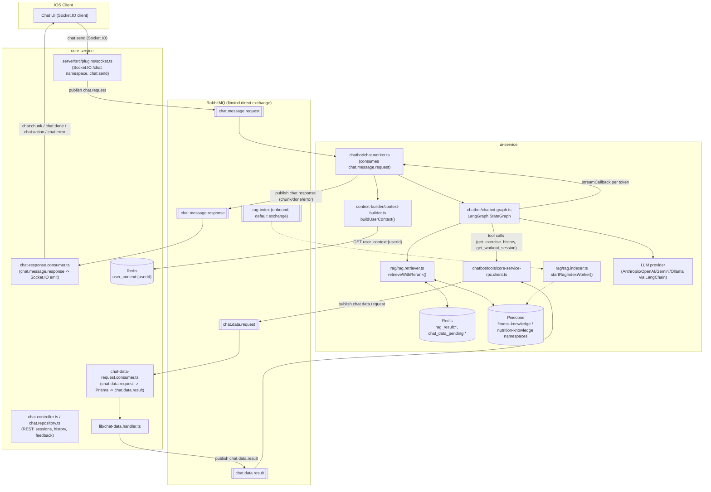

# RAG + Chatbot System — PRD / Architecture Doc

**Scope:** `ai-service/src/modules/rag/`, `ai-service/src/modules/chatbot/`, `ai-service/src/modules/context-builder/`, and the RabbitMQ/Redis/Pinecone wiring that connects them to `server/` (core-service) and the iOS client.

**Status:** Grounded entirely in the code as it exists today (read in full — no module in scope is a stub except where explicitly noted). Every architectural claim below cites a file path. Section 9 lists everything in `CLAUDE.md` / `docs/queue-contracts.md` that the code does **not** actually match.

---

## 1. Overview

FitMind's in-app AI coach is a streaming chat experience: the user asks a question (general fitness/nutrition knowledge, or "what did I eat/lift last time?"), and a LangGraph agent running in `ai-service` answers it — pulling from a Pinecone-backed knowledge base for general questions (RAG) and from the user's own logged data (via a cached `UserContextBundle` plus an RPC-style query back to `core-service`) for personal questions. The same RAG retriever and the same `UserContextBundle` also feed `plan-advisor`, a separate background LangGraph agent that proactively pushes coaching suggestions (`ai-service/src/modules/plan-advisor/plan-advisor.graph.ts`).

Primary users are end users of the iOS app, indirectly — they never call `ai-service` directly (per `CLAUDE.md`'s hard rule, confirmed in code: everything is RabbitMQ/Socket.IO, no HTTP route in `ai-service` faces the client).

---

## 2. Architecture



Key file references for this diagram:
- Socket.IO ingress + publish: `server/src/plugins/socket.ts:111-129`
- Response fan-out to client: `server/src/queues/chat-response.consumer.ts`
- Chat worker (ai-service ingress): `ai-service/src/modules/chatbot/chat.worker.ts`
- LangGraph agent: `ai-service/src/modules/chatbot/chatbot.graph.ts`
- Context bundle read: `ai-service/src/modules/context-builder/context-builder.ts:120-131`
- RAG retrieval: `ai-service/src/modules/rag/rag.retriever.ts`
- RAG indexing worker: `ai-service/src/modules/rag/rag.indexer.ts`
- Chat-data RPC client (ai-service side): `ai-service/src/modules/chatbot/tools/core-service-rpc.client.ts`
- Chat-data RPC handler (core-service side): `server/src/queues/chat-data-request.consumer.ts`, `server/src/lib/chat-data.handler.ts`
- Queue/exchange topology: `ai-service/src/plugins/rabbitmq.ts`

---

## 3. RAG pipeline deep dive

### 3.1 Pinecone setup
- Single Pinecone client/index, lazily constructed: `ai-service/src/modules/rag/rag.client.ts`. Index name from `PINECONE_INDEX_NAME` (default `fitmind-knowledge`).
- Two namespaces only, typed as a union: `RagNamespace = 'fitness-knowledge' | 'nutrition-knowledge'` (`rag.client.ts:19`). There is no per-user or per-plan namespace — this is a shared, global knowledge base, not personalized data.
- A dev-only helper script creates a **local** 768-dim index (`ai-service/scripts/create-local-pinecone-index.ts`) sized for the Ollama `embeddinggemma` embedding model, gated behind `PINECONE_API_KEY`.

### 3.2 Indexing flow (`rag.indexer.ts`)
- Chunking: a hand-rolled recursive-separator splitter (`splitText`, `rag.indexer.ts:9-29`) that tries separators in order `['\n\n', '\n', '. ', ' ', '']`, target chunk size 500 chars, 100-char overlap. This is a bespoke implementation, not LangChain's `RecursiveCharacterTextSplitter`.
- Embedding: whatever `buildEmbeddings()` resolves to (see §3.4) via `embeddings.embedDocuments(chunks)`.
- Each chunk becomes a Pinecone vector with `id: randomUUID()`, `metadata: { text: chunk, namespace, ...metadata }` — the raw chunk text is stored back in metadata so retrieval doesn't need a second fetch.
- Consumer: `startRagIndexWorker(channel)` consumes queue `rag-index`, `prefetch(2)`, expects `{ text, namespace, metadata? }` JSON. On failure it **always nacks without requeue** regardless of retry count (`rag.indexer.ts:69-77` — the `retryCount < 3` branch and the `else` branch both call `channel.nack(msg, false, false)`), so there is effectively no in-process retry for indexing failures; they go straight to the DLX-configured dead-letter path.
- **No producer of `rag-index` jobs was found anywhere in the repo** (checked both `ai-service` and `server` for any `channel.publish`/`sendToQueue` targeting `rag-index`). The queue is declared (`ai-service/src/plugins/rabbitmq.ts:37`) but never bound to an exchange in the bindings list (`rabbitmq.ts:59-102`) — it can only be reached by publishing directly to the queue name via the default exchange, and nothing in the codebase does this. There is also no seed script or ETL job that populates the knowledge base. **The knowledge base's initial content pipeline is unimplemented/undocumented in code.**

### 3.3 Retrieval flow (`rag.retriever.ts`) — this is the one part of CLAUDE.md's RAG description that is fully real
- **Cache-first**: `retrieveWithRerank(query, namespace, redis)` hashes `namespace:query` (SHA-256) into key `rag_result:{hash}` and returns the cached top-passages array if present (TTL 6h / `RAG_CACHE_TTL = 21600`).
- **HyDE**: `generateHyDE()` calls the `fast` LLM model to write a hypothetical expert answer to the query, which is then embedded and searched — a real HyDE implementation (`rag.retriever.ts:16-25`).
- **Multi-query**: `generateQueryVariants()` asks the `fast` model for 2 alternative phrasings; combined with the original query that's 3 query variants total, plus the HyDE answer = 4 parallel Pinecone searches (`rag.retriever.ts:27-42, 112-120`).
- Each search: `embedAndSearch()` embeds the text and queries Pinecone with `topK: 20` (`TOP_K = 20`), `includeMetadata: true`.
- Merge: `mergeCandidatesByHighestScore()` dedupes by chunk text, keeping each candidate's max score across the 4 searches, sorted descending (`rag.retriever.ts:61-77`).
- **Rerank**: `rerankCandidates()` calls Cohere's `rerank-english-v3.0` model via `cohere-ai` SDK, `topN: 5` (`RERANK_TOP_N = 5`). **If `COHERE_API_KEY` is absent, it silently falls back to `candidates.slice(0, RERANK_TOP_N)`** — i.e., highest-raw-similarity-score top-5, no rerank (`rag.retriever.ts:79-97`). This exactly matches CLAUDE.md's claim ("Pinecone similarity scores are used when COHERE_API_KEY is absent").
- Final 5 passages are cached and returned as plain `string[]` (chunk text only — no scores, no source metadata surfaced to the caller).

### 3.4 Embedding provider (`ai-service/src/providers/embedding-provider.factory.ts`)
- `resolveEmbeddingProvider()`: `EMBEDDING_PROVIDER` env var, else inferred — `ollama` if `LLM_PRIMARY_PROVIDER=ollama`, else `gemini` (`inferDefaultEmbeddingProvider`, lines 20-23). Matches CLAUDE.md.
- Default models: gemini → `text-embedding-004`, openai → `text-embedding-3-small`, ollama → `embeddinggemma`. Overridable via `EMBEDDING_MODEL`.
- Same `Embeddings` instance (module-level singleton via `buildEmbeddings()` called once at import time in both `rag.indexer.ts:7` and `rag.retriever.ts:14`) is reused for both indexing and querying, so vector-space consistency between index time and query time is enforced only in practice (same process config), not by any stored/validated model identifier in Pinecone metadata.

---

## 4. Chatbot / LangGraph agent deep dive

### 4.1 Graph shape (`ai-service/src/modules/chatbot/chatbot.graph.ts`)

State (`ChatState`, lines 23-37): LangGraph `MessagesAnnotation` (message history) plus custom channels — `userContext` (the cached bundle), `intent`, `retrievedDocs`, `sessionId`, `streamCallback` (a JS closure, not serializable — see §9), `workoutAction`.

Nodes and routing (`.addNode`/`.addConditionalEdges`, lines 377-419):
1. **`classify_intent`** — regex safety check first (`SAFETY_KEYWORDS`, line 62-63: diagnos/prescri/medication/surgery/injury/pain/doctor/hospital/medical advice), else an LLM call (`fast` model, with fallback) classifies into one of 8 intents: `fitness_rag`, `nutrition_rag`, `workout_plan_create`, `workout_day_create`, `workout_history`, `meal_history`, `progress_review`, `challenge_suggest`, or `general`.
2. Conditional routing out of `classify_intent`:
   - `safety` → `safety_redirect` (canned refusal message, no LLM call)
   - `fitness_rag` → `retrieve_fitness_rag` → `agent`
   - `nutrition_rag` → `retrieve_nutrition_rag` → `agent`
   - `workout_plan_create` / `workout_day_create` / `challenge_suggest` / `general` → `generate_response` directly (RAG and tool-calling are **skipped** for these — see §9 gap)
   - `workout_history` / `meal_history` / `progress_review` **AND** the cached context already has the relevant field → `generate_history_response` (answers straight from the Redis-cached bundle, no tool call)
   - otherwise → `agent` (model bound with tools, can request `get_exercise_history` / `get_workout_session` via the chat-data RPC)
3. **`agent`** (`callAgent`) — binds `buildChatTools()` (6 tools) to the primary/fallback chat model, invokes with system prompt + full history. If the model responds with tool calls, routes to `tools`; otherwise to `stream_final_response` (if a `streamCallback` exists) or `END`.
4. **`tools`** (`executeTools`) — LangGraph's prebuilt `ToolNode`, loops back to `agent`.
5. **`generate_response`** / **`generate_history_response`** — direct LLM calls with the system prompt (+ inline history data section for the latter), streamed via `streamWithFallback` if a callback is present.
6. **`extract_workout_structure`** — post-processes the assistant's final text for `workout_plan_create`/`workout_day_create`/`challenge_suggest` intents into a structured `workoutAction` payload (`workout-action-extractor.ts`, `challenge-action-extractor.ts`) that the client renders as an actionable card.
7. **`safety_redirect`** — terminal, canned message.

### 4.2 Checkpointing
`export const checkpointer = new MemorySaver()` and `chatbotGraph = graph.compile({ checkpointer })` (`chatbot.graph.ts:420-421`). `MemorySaver` is LangGraph's **in-process, in-memory** checkpointer from `@langchain/langgraph-checkpoint` — **not Redis-backed**. `thread_id: sessionId` is passed at invoke time (`chat.worker.ts:161`), so LangGraph *would* maintain per-session state across turns, but only within the lifetime of a single Node.js process and only for whichever worker instance handled the message — there is no cross-instance/cross-restart session continuity. This directly contradicts CLAUDE.md's "LangGraph manages stateful agent workflows ... with Redis checkpointing for session continuity" claim (flagged in §9).

In practice this mostly doesn't matter for correctness because `chat.worker.ts` invokes the graph fresh each time with only `messages: [new HumanMessage(content)]` (a single new message, not the full history) — multi-turn memory for the LLM prompt actually comes from `conversationHistory`-style context reconstruction... except that doesn't happen either (see §9): the worker does **not** load prior turns from `chat.repository` into the graph invocation. Each invocation is effectively single-turn from the graph's point of view, other than whatever the in-memory checkpointer retains within one process's uptime for a given `sessionId`.

### 4.3 Streaming
- End-to-end token streaming works, but only for the `general`/history/no-tool-call plain generation paths (`generate_response`, `generate_history_response`, `stream_final_response`), via `streamWithFallback()` (`ai-service/src/providers/llm-with-fallback.ts:59-111`), which streams from the primary model and retries transient errors (429/500/503/"overloaded"/"high demand") up to 3 times with linear backoff before falling back to the fallback provider.
- Each token triggers `streamCallback(token)` (`chatbot.graph.ts:228-232, 268-269, 291-292`), which in `chat.worker.ts` (`publishChunk`, lines 17-37) wraps it in an envelope and publishes to `fitmind.direct` / routing key `chat.response` with `persistent: false` (chunks are not durable — acceptable since they're ephemeral UI updates, but distinct from the `done`/`error` messages, which are also published with `persistent: false`, meaning **the final assistant message itself is not durably queued either** — see §9).
- On the `core-service` side, `chat-response.consumer.ts` re-emits chunks as Socket.IO events (`chat:chunk`, `chat:done`, `chat:error`, `chat:action`) scoped to room `user:{userId}` on namespace `/chat` (`server/src/plugins/socket.ts`, `server/src/queues/chat-response.consumer.ts:38-70`). This is Socket.IO, **not** a raw `URLSessionWebSocketTask`-compatible protocol as described in CLAUDE.md's iOS stack section — that's a client-side detail outside this doc's scope but worth flagging since Socket.IO's wire protocol differs from a bare WebSocket.
- Tool-calling turns (the `agent`/`tools` loop) do **not** stream incrementally — `callAgent` uses `invokeWithFallback` (non-streaming `.invoke`), so a user asking about their last workout via the tool-calling path gets one "Looking up your logged data..." chunk immediately, then waits for the full non-streamed response before `stream_final_response` flushes it in one shot (`chatbot.graph.ts:230-232, 303-324`).

### 4.4 The chat-data RPC pattern (`chat.data.request` / `chat.data.result`)
- Two of the six chat tools (`get_exercise_history`, `get_workout_session` — `chatbot/tools/index.ts:77-115`) go through a real request/response RPC over RabbitMQ, implemented as a correlation-ID-keyed in-memory `Map` of pending promises (`core-service-rpc.client.ts:19-46`):
  1. `fetchChatData()` generates a `correlationId`, stores a short-lived Redis marker `chat_data_pending:{correlationId}` (TTL 30s, informational only — not used to resolve the promise), publishes `chat.data.request` to `fitmind.direct`, and awaits a promise with a **5000ms hardcoded timeout** (`RPC_TIMEOUT_MS`).
  2. `core-service`'s `chat-data-request.consumer.ts` consumes it, calls `handleChatDataRequest()` (`server/src/lib/chat-data.handler.ts`) against Prisma, and always `ack`s (even on failure — it publishes a `status: 'failed'` result instead of nacking).
  3. `ai-service`'s `chat-data-result.consumer.ts` looks up the correlation ID and calls `resolveChatDataRpcResult()` to settle the pending promise back in `core-service-rpc.client.ts`.
- The other four tools (`get_last_workout`, `get_last_meal`, `get_recent_meals`, `get_nutrition_summary`) do **not** use this RPC at all — they read straight from the cached `UserContextBundle` in Redis via `buildUserContext()` (`chatbot/tools/index.ts:14-75`), so they're only as fresh as the 15-minute `user_context:{userId}` TTL, not a live DB query. Only exercise history and a specific past session go through a live round-trip to Postgres.
- **Correlation-ID resolution lives in an in-process `Map`** (`pendingByCorrelationId`, `core-service-rpc.client.ts:19`), so if `ai-service` runs multiple worker processes/replicas, only the process instance that issued the RPC can resolve it — a `chat.data.result` delivered to a different replica than the one awaiting it would just sit unresolved until the 5s timeout fires. There's no queue-level sharding/affinity visible in the code to guarantee this.

---

## 5. Context-builder (`ai-service/src/modules/context-builder/context-builder.ts`)

- `buildUserContext(userId, redis)` is a **thin Redis read-through**, not an assembly function: `redis.get('user_context:' + userId)`, JSON-parse, return `null` on miss or parse failure (lines 120-131). All the actual assembly (querying Postgres, computing streaks, gamification state, etc.) happens on the `core-service` side and is **out of scope for `ai-service`** — `core-service` writes the bundle to Redis (per `CLAUDE.md`: "written by core-service, read by ai-service"). Nothing in `ai-service/src/modules/context-builder/` builds the bundle from scratch; it only reads and formats it.
- `UserContextBundle` shape (`context-builder.ts:48-118`): `profile` (name/sex/age/weight/height/goal/activityLevel/dietaryPref/countryCode/tdee/macroTargets/subscriptionTier), `activePlan`, `recentSessions[]`, `todayNutrition`, `recentNutrition[]`, `stats` (totalWorkouts/currentStreakDays), `gamification` (recentMilestones/journey/activeChallenge), `lastWorkoutDetail` (full exercise/set-level detail with PR/performance flags and vs-plan/vs-previous deltas), `lastMealDetail`, `recentMeals[]`.
- `formatContextForPrompt(ctx)` (lines 133-206) renders this into a plain-text block injected into the system prompt (see `chatbot.graph.ts:buildSystemPrompt`, lines 65-74) — profile line, goal/activity/diet, TDEE, macro targets, active plan, workout stats, up to 3 recent sessions, today's nutrition, last workout (top 5 exercises with performance flags), last meal, recent achievements (gamification milestones, explicitly instructed to be acknowledged "briefly and naturally only if relevant"), journey/chapter progress, active challenge.
- Cache key/TTL: `user_context:{userId}`, TTL 15 min, per `CLAUDE.md` (write side is in `server/`, not verified in this scope since it's outside `ai-service`).

---

## 6. Message contracts actually implemented

Source of truth used: `ai-service/src/queues/job.types.ts` + the two consumer/producer files, cross-checked against `docs/queue-contracts.md` at the repo root.

| Queue | Routing key | Exchange (as coded) | Producer | Consumer |
|---|---|---|---|---|
| `chat.message.request` | `chat.request` | `fitmind.direct` | `server/src/plugins/socket.ts:111-129` | `ai-service/src/modules/chatbot/chat.worker.ts:131` |
| `chat.message.response` | `chat.response` | `fitmind.direct` | `chat.worker.ts` (`publishChunk`/`publishDone`/`publishError`) | `server/src/queues/chat-response.consumer.ts` |
| `chat.data.request` | `chat.data.request` | `fitmind.direct` | `core-service-rpc.client.ts:76` | `server/src/queues/chat-data-request.consumer.ts` |
| `chat.data.result` | `chat.data.result` | `fitmind.direct` | `server/src/queues/chat-data-request.consumer.ts:55` | `ai-service/src/queues/chat-data-result.consumer.ts` |
| `rag-index` | — (unbound) | none (declared only) | **none found** | `ai-service/src/modules/rag/rag.indexer.ts:startRagIndexWorker` |

Actual payload shapes as coded:

```typescript
// ai-service/src/modules/chatbot/chat.worker.ts:9-15 — what the worker actually reads
interface ChatMessageRequest {
  sessionId: string
  userId: string
  messageId: string
  content: string
  imageUrl?: string | null   // accepted but never read anywhere in the graph/worker
}

// ai-service/src/queues/job.types.ts:27-37
type ChatDataToolName = 'get_exercise_history' | 'get_workout_session'
interface ChatDataRequest {
  userId: string
  tool: ChatDataToolName
  args: { exerciseName?: string; sessionId?: string; limit?: number }
}
interface ChatDataResult {
  correlationId: string
  status: 'completed' | 'failed'
  result: unknown | null
  errorMessage: string | null
}
```

See §9 for how this diverges from `docs/queue-contracts.md`'s documented `ChatMessageRequest`/`ChatMessageResponse` shapes.

---

## 7. Use cases / user flows (traced through real code)

### 7.1 "What should I eat to hit more protein?" (general nutrition knowledge)
1. `server/src/plugins/socket.ts` receives `chat:send`, publishes `chat.message.request`.
2. `chat.worker.ts` calls `buildUserContext()`, invokes `chatbotGraph`.
3. `classifyIntent` → `nutrition_rag`.
4. `retrieveNutritionRag` → `retrieveWithRerank(query, 'nutrition-knowledge', redis)` (`rag.retriever.ts`) — HyDE + 2 query variants + original = 4 Pinecone searches in the `nutrition-knowledge` namespace, merged, Cohere-reranked (or top-5-by-score if no Cohere key), cached 6h.
5. `agent` node builds system prompt with `formatContextForPrompt` (user's macro targets/diet pref) + the 5 retrieved passages, calls the `chat` model.
6. No tool calls expected → `stream_final_response` streams the answer token-by-token back through `chat.response` → Socket.IO `chat:chunk`/`chat:done`.

### 7.2 "How was my last workout?" (personal history, cache hit)
1. Same ingress. `classifyIntent` → `workout_history`.
2. `hasHistoryContextForIntent` checks `ctx.lastWorkoutDetail` is present in the cached bundle → true.
3. Routes straight to `generate_history_response`, which appends `buildHistoryDataSection` (the raw JSON of `lastWorkoutDetail`) to the system prompt and instructs the model to cite exact numbers — no tool call, no RAG, answered entirely from the 15-minute-old Redis cache.

### 7.3 "What's my history on incline dumbbell press specifically?" (tool-calling / live RPC)
1. `classifyIntent` → likely falls through to the generic `agent` path (not one of the direct-route intents) since this doesn't match `workout_history`/`meal_history`/`progress_review` cleanly, or does and the cache lacks that specific exercise — either way it reaches `agent` with tools bound.
2. Model emits a tool call for `get_exercise_history` (`chatbot/tools/index.ts:77-96`).
3. `executeTools` → `fetchChatData()` → publishes `chat.data.request` → `core-service`'s `chat-data-request.consumer.ts` → `handleChatDataRequest()` queries Postgres via Prisma → publishes `chat.data.result` → `resolveChatDataRpcResult()` settles the pending promise (5s timeout budget) → tool result fed back into `agent` loop → final answer generated (non-streamed, then flushed once via `stream_final_response`).

### 7.4 "Build me a push/pull/legs plan" (structured action extraction)
1. `classifyIntent` → `workout_plan_create`.
2. Routed directly to `generate_response` (no RAG, no tools) → model free-text response.
3. `extract_workout_structure` → `extractWorkoutPlanAction()` (`workout-action-extractor.ts`) parses the free-text response into a structured `WorkoutActionPayload` using the `fast` model.
4. `publishDone()` includes `actionPayload` in the `chat.message.response` envelope → `chat-response.consumer.ts` additionally emits `chat:action` → client renders an actionable "Save this plan" card, backed also by `server/src/modules/workouts/workout-from-chat.service.ts` (outside RAG/chatbot scope but the landing point for this action).

### 7.5 Proactive coaching suggestion (plan-advisor, not chatbot-triggered but shares the RAG retriever)
1. `plan-advisor.cron.ts` (daily) or a trigger publishes to `plan.analysis.trigger`.
2. `plan-advisor.worker.ts` invokes `planAdvisorGraph` (`plan-advisor.graph.ts`): loads the same cached `UserContextBundle`, computes rule-based deltas (protein deficit days, missed-workout streak, calorie surplus vs. low session count, volume decline — all hardcoded thresholds at the top of the file), classifies an issue type, and — only if one is found — calls `retrieveWithRerank()` against `fitness-knowledge` or `nutrition-knowledge` depending on issue type, using a **hand-templated query string per issue type** (`buildRagQuery`, not derived from the user's actual words).
3. Generates a suggestion via a JSON-mode LLM prompt, dedupes against `plan_suggestion_dedup:{userId}:{triggerReason}:{issueType}` (7-day TTL), publishes `plan.suggestion.result`.

### 7.6 Medical/safety question ("I have shoulder pain, what's wrong?")
1. `classifyIntent`'s regex `SAFETY_KEYWORDS` matches "pain" before any LLM call is made.
2. Routes directly to `safety_redirect` — a hardcoded refusal message, zero LLM/RAG/tool cost.

---

## 8. Non-functional considerations found in code

- **Retry/DLQ**: All ai-service queues get `x-dead-letter-exchange: fitmind.dlx` at assert time (`ai-service/src/plugins/rabbitmq.ts:50-56`). The chat worker and RAG indexer both track `x-retry-count` from message headers but, as coded, **every failure path calls `nack(msg, false, false)` regardless of the count** (`chat.worker.ts:213-218`, `rag.indexer.ts:70-76`) — the `if (retryCount < 3)` branches exist but both branches do the same thing, so there's no actual difference between "still retrying" and "exhausted retries" in current behavior; every failure goes straight to the DLX on first attempt rather than being requeued for retry. This looks unintentional (dead retry logic) — flagged in §9.
- **LLM fallback + transient retry**: real and well-implemented in `providers/llm-with-fallback.ts` — up to 3 attempts with linear backoff (1s, 2s) on 429/500/503/"overloaded"/"high demand" errors, then falls over to the configured fallback provider for both `.invoke` and `.stream` paths.
- **RAG result caching**: `rag_result:{sha256(namespace:query)}` in Redis, 6h TTL (`rag.retriever.ts:10, 104-110, 127`) — exact-query cache only (no semantic/fuzzy cache hit).
- **Chat-data RPC timeout**: hardcoded 5000ms (`core-service-rpc.client.ts:10`), no configurability via env var.
- **Plan-suggestion dedup**: `plan_suggestion_dedup:{userId}:{triggerReason}:{issueType}`, 7-day TTL (`plan-advisor.graph.ts:dedupCheck`) — matches CLAUDE.md's documented Redis namespace.
- **Rate limiting**: **not found** anywhere in the chatbot/RAG code path (no `rate_limit:{userId}:{endpoint}` usage inside `ai-service`; that namespace may be enforced only on the `core-service` HTTP/Socket.IO ingress side, which is outside this doc's scope and was not verified here).
- **User-facing error normalization**: `userFacingChatError()` (`chat.worker.ts:116-126`) maps provider rate-limit/overload errors to a generic "temporarily busy" message before publishing `chat.message.response` with `type: 'error'`.

---

## 9. Gaps / discrepancies vs. CLAUDE.md and docs/queue-contracts.md

1. **LangGraph checkpointing is not Redis-backed.** CLAUDE.md states "LangGraph manages stateful agent workflows ... with Redis checkpointing for session continuity." The code uses `MemorySaver` from `@langchain/langgraph-checkpoint` (`chatbot.graph.ts:2, 420`) — an in-process in-memory checkpointer. No `RedisSaver`/custom Redis checkpointer implementation exists anywhere under `ai-service/src`. Session continuity across process restarts or multiple worker replicas is not guaranteed.

2. **Multi-turn history is not actually threaded into the graph.** `chat.worker.ts` invokes `chatbotGraph.invoke({ messages: [new HumanMessage(content)], ... })` with only the single new message (`chat.worker.ts:150-151`) — no prior turns are loaded from `chat.repository` or elsewhere. Given point 1, there is effectively no reliable multi-turn conversational memory in the current implementation beyond whatever a single process's in-memory checkpointer retains for the same `sessionId` within its uptime.

3. **`docs/queue-contracts.md`'s `ChatMessageRequest`/`ChatMessageResponse` shapes don't match either side's real code.** The doc (`docs/queue-contracts.md:138-170`) specifies `conversationHistory` and `userContextBundle` fields on the request, and `assistantMessageId`/`tokensUsed`/`modelUsed`/`latencyMs` on the response. Neither field appears in the actual publisher (`server/src/plugins/socket.ts:111-118`, which only sends `sessionId, userId, messageId, content, imageUrl`) nor the actual consumer interface (`ai-service/src/modules/chatbot/chat.worker.ts:9-15`). The real response envelope is `{ userId, sessionId, type: 'chunk'|'done'|'error', token?, content?, error?, actionPayload? }` (`chat.worker.ts:24-114`), not the documented shape at all. This is a genuine spec/code divergence on both sides of the boundary, not just an ai-service gap.

4. **`imageUrl` on `chat.message.request` is accepted but never used.** It's in the interface and the Socket.IO payload, but nothing in `chatbot.graph.ts` or `chat.worker.ts` reads `payload.imageUrl` — meal-photo-in-chat is not wired to any vision call in this module.

5. **`plan.analysis.trigger` is bound to `fitmind.direct` with routing key `plan.trigger`, not `fitmind.topic` with `plan.*`** as both CLAUDE.md and `docs/queue-contracts.md` describe (`docs/queue-contracts.md:56` vs. `ai-service/src/plugins/rabbitmq.ts:25, 66`). It behaves as a point-to-point queue in practice, not a broadcast topic.

6. **`rag-index` has no producer anywhere in the codebase**, and the queue is declared but never bound to an exchange (`rabbitmq.ts:37` vs. bindings list `59-102`). There is no seed script, admin endpoint, or scheduled job that populates the fitness/nutrition Pinecone namespaces. The knowledge-base content pipeline that CLAUDE.md implies exists ("Pinecone indexing" under `rag/`) is, in terms of actually getting documents in, **not implemented** — only the consumer half exists.

7. **Retry-count branching in both `chat.worker.ts` and `rag.indexer.ts` is dead code** — both branches of the `if (retryCount < 3)` check call the identical `channel.nack(msg, false, false)`, so messages are never actually retried in-place; they route to the DLX on the very first failure. This contradicts the documented "3 attempts via x-retry-count" retry policy (`docs/queue-contracts.md:77`) even though the DLX destination itself is correctly configured.

8. **Model defaults documented in CLAUDE.md don't match the code's `DEFAULT_MODELS` table.** `ai-service/src/providers/llm-provider.factory.ts:10-31` currently has `anthropic.fast = 'claude-haiku-4-5-20251001'` (CLAUDE.md says `claude-3-haiku-20240307`), `gemini.* = 'gemini-2.5-flash'` across all tasks (CLAUDE.md says `gemini-2.0-flash`), and `ollama.* = 'qwen3.5'` (CLAUDE.md says `llama3.2`/`llava`). These look like real, deliberate upgrades made after CLAUDE.md was last updated, not code that's broken — just a stale doc.

9. **The chat-data RPC only covers 2 of the 6 chat tools.** CLAUDE.md's "chat.data.request/result — chatbot tool RPC (ai-service fetches user workout/meal history from core-service)" reads as if all such lookups go through this RPC. In fact only `get_exercise_history` and `get_workout_session` do (`chatbot/tools/index.ts:77-115`); `get_last_workout`, `get_last_meal`, `get_recent_meals`, `get_nutrition_summary` read from the Redis-cached `UserContextBundle` only (`chatbot/tools/index.ts:14-75`) and never touch RabbitMQ or Postgres directly.

10. **Streaming is not implemented for tool-calling turns.** CLAUDE.md's "Streaming chat" description doesn't distinguish this, but in practice any question that triggers a tool call (`agent`/`tools` loop) is answered as one non-streamed blob flushed at the end (`chatbot.graph.ts:303-324`), while pure-RAG and pure-history answers stream token-by-token. This is a real UX-relevant asymmetry worth knowing about.

11. **Cross-instance RPC correlation is process-local.** `core-service-rpc.client.ts` resolves pending chat-data RPCs via an in-memory `Map` (line 19). If `ai-service` ever runs more than one replica of the chat worker, a `chat.data.result` can be delivered to a different process instance than the one holding the pending promise, causing a guaranteed 5s timeout with no cross-process handoff. Not disqualifying for a single-instance deployment, but a real scaling constraint not mentioned anywhere in the docs.

12. **Miscellaneous: leftover debug instrumentation.** `chatbot.graph.ts` (`classifyIntent`, lines 178-191), `chat.worker.ts` (lines 173-193, 198-211), and `server/src/queues/chat-response.consumer.ts` (lines 47-60) all contain `fetch('http://127.0.0.1:7886/ingest/...')` calls tagged `#region agent log` — these appear to be temporary debugging telemetry (fire-and-forget POSTs to a local debug-session ingest endpoint) left in the committed code. Not part of the documented architecture at all; flagged here since it's the kind of thing that should either be removed or turned into a proper feature-flagged logging mechanism before this code is considered production-clean.

### What *did* hold up against CLAUDE.md
- Four-provider LLM abstraction via LangChain, primary/fallback selection, provider-per-task model config: **confirmed real** (`providers/llm-provider.factory.ts`, `providers/llm-with-fallback.ts`).
- HyDE, multi-query, Cohere rerank (with graceful no-op fallback), Pinecone hybrid retrieval: **confirmed real and matches the description closely** (`rag/rag.retriever.ts`).
- LangGraph-based conversational agent with conditional routing: **confirmed real** (`chatbot/chatbot.graph.ts`), though the "stateful ... with Redis checkpointing" half of that sentence is not (see gap #1).
- `chat.data.request`/`chat.data.result` RPC pattern for tool calls reaching back into core-service: **confirmed real**, just narrower in scope than the docs imply (gap #9).
- Embedding provider configurability (`EMBEDDING_PROVIDER`, default gemini/ollama-when-ollama-primary): **confirmed real** (`providers/embedding-provider.factory.ts`).
